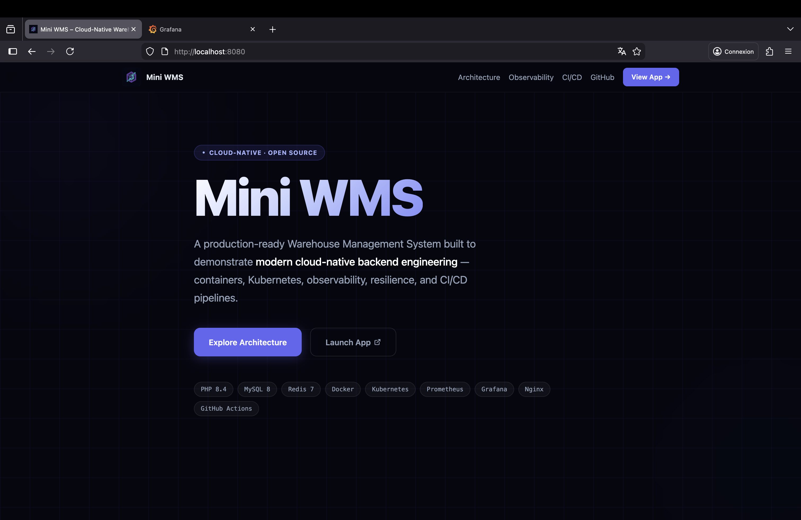
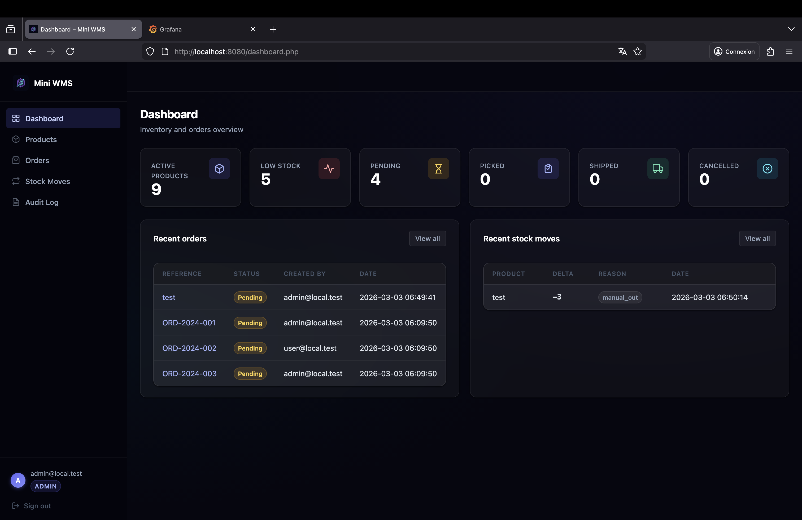
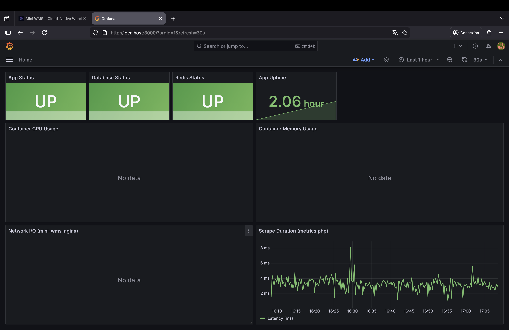
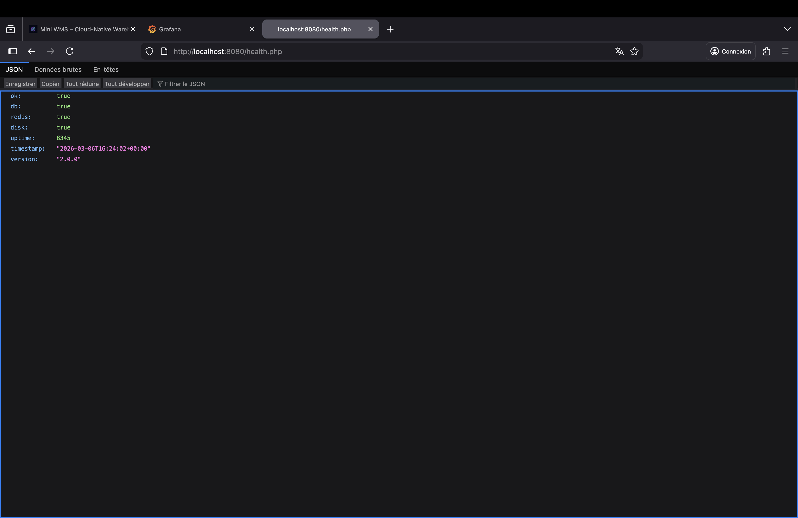
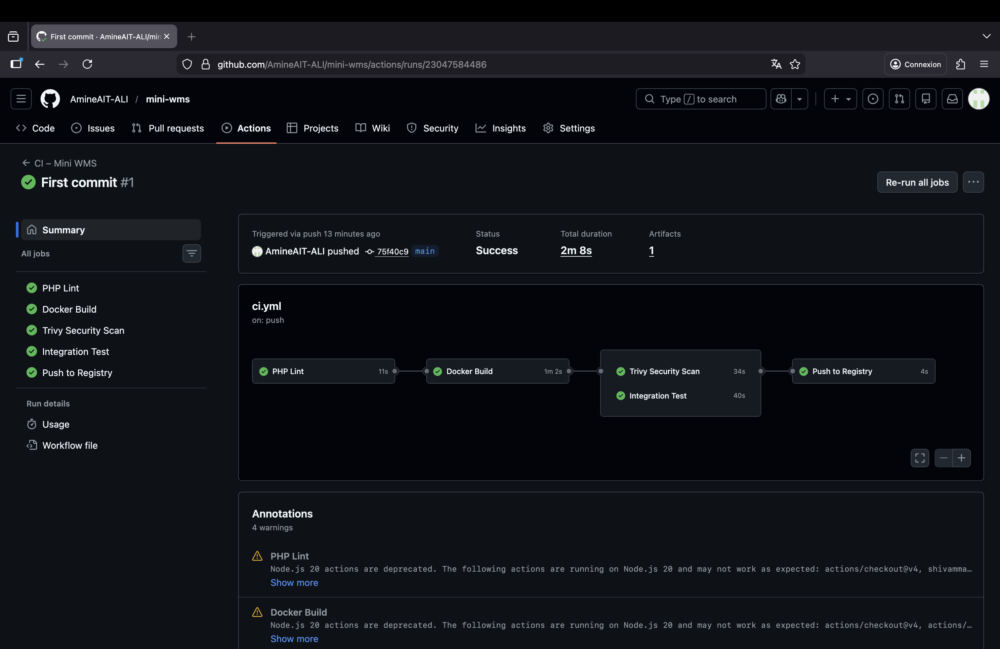

# Mini WMS – Cloud-Native

> PHP 8.4 · MySQL 8 · Redis 7 · Nginx · Docker Compose · Kubernetes · Prometheus · Grafana · GitHub Actions

Un système de gestion d'entrepôt production-ready conçu pour démontrer l'ingénierie PHP cloud-native : conteneurisation, logs structurés, health probes, métriques Prometheus, dashboards Grafana, auto-scaling Kubernetes HPA, tests de résilience et un pipeline CI/CD complet.

---

## Objectif

Mini WMS est volontairement simple en tant qu'application, mais complexe en tant que système d'ingénierie.

L'objectif n'est pas de construire un ERP complet, mais de démontrer comment un backend PHP peut être conçu avec des pratiques cloud-natives modernes : observable, résilient, scalable, et déployable depuis un simple `docker compose up`.

---

## Pourquoi ce projet

La plupart des portfolios PHP s'arrêtent au "CRUD avec un framework". Ce projet va plus loin : l'application est le véhicule, l'ingénierie qui l'entoure est le sujet. Chaque couche — de la config Nginx à la readiness probe K8s — est une décision de conception délibérée, justifiée et testée.

---

## Ce qu'il démontre

| Couche | Contenu |
|---|---|
| **Application** | Auth par rôles, CSRF, audit log, transactions de stock, pattern PRG |
| **Conteneurisation** | Dockerfile multi-stage, image Alpine minimale (~28 MiB au repos) |
| **Observabilité** | `/health.php` (liveness + readiness), `/metrics.php` (Prometheus), logs JSON structurés avec UUIDv4 `request_id` |
| **Résilience** | Dégradation gracieuse sur panne DB/Redis, rétablissement automatique `< 10 s` |
| **Scalabilité** | 1 943 req/s sur l'endpoint health (ApacheBench), Docker Compose `--scale`, K8s HPA 1→5 replicas |
| **CI/CD** | GitHub Actions : lint → build → scan Trivy → test d'intégration → push Docker |
| **Sécurité** | Scan Trivy CRITICAL/HIGH, CSRF sur chaque formulaire, requêtes préparées, mots de passe bcrypt cost-12 |

---

## Architecture

```
                ┌──────────────────────────────────────────┐
                │           Client / Load Balancer          │
                └──────────────────┬───────────────────────┘
                                   │ :8080
                ┌──────────────────▼───────────────────────┐
                │       Nginx 1.25 (reverse proxy)          │
                │  fichiers statiques · proxy FastCGI · gzip│
                └──────────────────┬───────────────────────┘
                                   │ :9000 (FastCGI)
                ┌──────────────────▼───────────────────────┐
                │     PHP-FPM 8.4-alpine (conteneur app)    │
                │  pdo_mysql · opcache · extension redis     │
                └─────────┬────────────────────┬───────────┘
                          │                    │
           ┌──────────────▼──────┐    ┌────────▼──────────┐
           │   MySQL 8 (db)      │    │  Redis 7 (cache)   │
           │   utf8mb4_unicode   │    │  persistance AOF   │
           └─────────────────────┘    └───────────────────┘

Stack d'observabilité (même réseau Docker) :
  ┌──────────────────┐   scrape    ┌──────────────────┐   datasource   ┌──────────────┐
  │  cAdvisor :8081  │────────────►│ Prometheus :9090  │───────────────►│ Grafana :3000│
  │  /metrics.php    │────────────►│  cycle 15s        │                └──────────────┘
  │  /health.php     │────────────►└──────────────────┘
  └──────────────────┘
```

---

## Pourquoi cette architecture

- **Nginx** gère les assets statiques et le proxy FastCGI avec une faible empreinte mémoire — aucun processus PHP mobilisé pour servir des fichiers CSS.
- **PHP-FPM** isole le runtime applicatif du serveur web ; les workers sont pré-forkés et réutilisés, permettant le scaling horizontal sans fuite d'état.
- **MySQL 8** assure la cohérence transactionnelle des flux de stock et commandes — les décréments de stock et insertions d'articles de commande s'exécutent dans un seul bloc `BEGIN/COMMIT`, évitant les écritures partielles.
- **Redis 7** est câblé pour le stockage de session et prépare la plateforme au cache partagé et aux futurs workloads de file sans changements architecturaux.
- **Prometheus + Grafana** fournissent une observabilité de premier ordre avec un modèle de scrape pull — pas de vendor lock-in, pas d'overhead agent côté application.
- **Kubernetes HPA** démontre le scaling horizontal sous charge CPU réelle, couplé aux readiness probes qui retirent les pods du pool d'endpoints lors de pannes de dépendances.
- **Image de base Alpine** réduit la surface d'attaque et maintient l'image à ~28 MiB au repos, ce qui compte pour le temps de pull en CI et la latence de cold-start en K8s.

---

## Preuves

- **Health checks** : `/health.php` retourne `200` quand toutes les dépendances sont saines, `503` sinon — utilisé comme liveness et readiness probe en K8s.
- **Métriques** : endpoint de scrape Prometheus sur `/metrics.php` expose le statut DB/Redis, l'uptime et la durée de scrape ; Grafana auto-provisionne la datasource et le dashboard.
- **Résilience** : panne DB détectée en `< 1 s`, endpoint health retourne `503`, application se rétablit automatiquement en `< 10 s` après redémarrage — [log de test complet](RESILIENCE_TEST.md).
- **Scalabilité** : `1 943 req/s` sur l'endpoint health, `5 088 req/s` sur la page login, zéro échec sur tous les runs ApacheBench — [résultats complets](SCALING_TEST.md).
- **CI/CD** : lint → build → scan Trivy CRITICAL/HIGH → test d'intégration docker-compose → push Docker sur `main` — pipeline défini dans [`.github/workflows/ci.yml`](../.github/workflows/ci.yml).

---

## Screenshots

### Page d'accueil


### Application – Dashboard


### Observabilité – Grafana


### Endpoint Health


### CI/CD – GitHub Actions (vert)


---

## Endpoints clés

| Endpoint | Méthode | Rôle |
|---|---|---|
| `/health.php` | GET | Liveness & readiness probe — retourne `200` ou `503` |
| `/metrics.php` | GET | Endpoint de scrape Prometheus |
| `/login.php` | GET / POST | Authentification |
| `/dashboard.php` | GET | Vue opérationnelle (KPIs, commandes récentes, stock bas) |
| `/products.php` | GET | Catalogue produits avec recherche |
| `/orders.php` | GET | Liste des commandes avec filtre par statut |
| `/stock_moves.php` | GET | Historique des mouvements de stock |
| `/audit.php` | GET | Journal d'audit — admin uniquement |

---

## Développement local

La stack complète tourne en local via Docker Compose — aucune installation PHP ou MySQL requise.

Services démarrés avec `docker compose up` :

| Service | Rôle | Port |
|---|---|---|
| Nginx | Reverse proxy, fichiers statiques | 8080 |
| PHP-FPM | Runtime applicatif | 9000 (interne) |
| MySQL 8 | Base de données relationnelle | 3306 (interne) |
| Redis 7 | Cache de session | 6379 (interne) |
| Prometheus | Collecteur de métriques | 9090 |
| Grafana | Interface dashboard | 3000 |
| cAdvisor | Métriques conteneurs | 8081 |

---

## Démarrage rapide

### Prérequis

- Docker Desktop ≥ 4.x (avec Docker Compose v2)
- 2 Go de RAM disponibles pour les conteneurs

### 1. Cloner et démarrer (Docker uniquement)

```bash
git clone https://github.com/AmineAIT-ALI/mini-wms.git
cd mini-wms
docker compose -f deploy/docker/docker-compose.yml up -d
```

### 2. Attendre que tous les conteneurs soient healthy (~60 s)

```bash
docker compose -f deploy/docker/docker-compose.yml ps
```

Résultat attendu :
```
mini-wms-app          Up X minutes (healthy)
mini-wms-cadvisor     Up X minutes (healthy)
mini-wms-db           Up X minutes (healthy)
mini-wms-grafana      Up X minutes
mini-wms-nginx        Up X minutes (healthy)
mini-wms-prometheus   Up X minutes
mini-wms-redis        Up X minutes (healthy)
```

### 3. Ouvrir l'application

| Service | URL | Identifiants |
|---------|-----|--------------|
| App | http://localhost:8080 | admin@local.test / Password123! |
| Prometheus | http://localhost:9090 | — |
| Grafana | http://localhost:3000 | admin / admin123 |
| cAdvisor | http://localhost:8081 | — |

---

## Observabilité

### Endpoint Health

```bash
curl http://localhost:8080/health.php
```

```json
{
  "ok": true, "db": true, "redis": true, "disk": true,
  "uptime": 1477, "timestamp": "2026-03-03T06:34:34+00:00", "version": "2.0.0"
}
```

Retourne **200** quand tous les checks passent, **503** quand une dépendance est indisponible.

### Métriques Prometheus

```bash
curl http://localhost:8080/metrics.php
```

```
mini_wms_up 1
mini_wms_db_up 1
mini_wms_redis_up 1
mini_wms_uptime_seconds 1307
mini_wms_scrape_duration_seconds 0.002962
```

Prometheus scrape toutes les 15 secondes. Grafana auto-provisionne la datasource et le dashboard.

### Logs JSON structurés

Chaque requête HTTP produit une entrée JSON dans `logs/app.log` :

```json
{
  "timestamp": "2026-03-03T06:57:33+00:00",
  "level": "INFO",
  "request_id": "8a866a24-c597-4f91-a3d1-527761a522f9",
  "message": "request completed",
  "status_code": 200,
  "response_time_ms": 0.08,
  "request": {"method": "GET", "uri": "/login.php", "ip": "185.85.0.29"},
  "app": "mini-wms",
  "version": "2.0.0"
}
```

Champs : `request_id` (UUIDv4 par requête), `response_time_ms`, `status_code`, IP client.
Schéma complet et exemples de requêtes : [LOGGING.md](LOGGING.md).

---

## Résilience

Testé et documenté dans [RESILIENCE_TEST.md](RESILIENCE_TEST.md) :

| Scénario | Détection | Comportement app | Rétablissement |
|----------|-----------|------------------|----------------|
| Crash conteneur app | nginx 504 | Gateway timeout | Auto-restart (compose/K8s) |
| MySQL indisponible | `db: false` dans `/health.php` | HTTP 503 sur health | Reconnexion auto en < 10 s |
| Redis indisponible | `redis: false` dans `/health.php` | HTTP 503 sur health, pages → 200 | Reconnexion auto en < 15 s |

```bash
# Simuler une panne DB
docker stop mini-wms-db
curl http://localhost:8080/health.php   # → {"ok":false,"db":false,...}  HTTP 503

# Rétablissement
docker start mini-wms-db
curl http://localhost:8080/health.php   # → {"ok":true,...}  HTTP 200  (< 10s)
```

---

## Scalabilité

Testé avec ApacheBench — [SCALING_TEST.md](SCALING_TEST.md) :

| Test | Concurrence | Débit | Latence moy. | Échecs |
|------|-------------|-------|--------------|--------|
| Endpoint health | 20 | 1 943 req/s | 10,3 ms | 0 |
| Endpoint health (charge) | 50 | 1 922 req/s | 26,0 ms | 0 |
| Page login | 10 | 5 088 req/s | 1,97 ms | 0 |

**Empreinte mémoire :** App + Nginx = ~28 MiB au repos. Cinq replicas ≈ 90 MiB.

### Docker Compose scale

```bash
docker compose -f deploy/docker/docker-compose.yml up -d --scale app=3
```

### Kubernetes HPA

```bash
kubectl apply -f deploy/k8s/
kubectl get hpa -n mini-wms -w
# Scale de 1 → 5 replicas quand CPU > 50%
```

**Fonctionnalités K8s clés :**
- `readinessProbe` sur `/health.php` → retire le pod des endpoints lors d'une panne DB
- `livenessProbe` sur `/health.php` → redémarre le pod en cas de deadlock/OOM
- `HPA` scale de 1 → 5 replicas à 50% CPU
- `PVC` pour la persistance des données MySQL
- `ConfigMap` pour la config env, `Secret` pour le mot de passe DB

---

## CI/CD

Workflow GitHub Actions : [`.github/workflows/ci.yml`](../.github/workflows/ci.yml)

```
push / PR
    │
    ▼
[lint]        PHP parallel-lint (tous les fichiers .php)
    │
    ▼
[build]       docker buildx (layers en cache, sauvegardé comme artefact)
    │
    ├──▶ [security]      Scan Trivy image (CRITICAL/HIGH → échec)
    │                    Trivy filesystem SARIF → onglet Security GitHub
    │
    └──▶ [integration]   docker compose up → health check → smoke test
    │
    ▼  (branche main uniquement)
[push]        docker push vers DockerHub (tags : latest + SHA court)
```

**Secrets GitHub requis :**
- `DOCKERHUB_USERNAME`
- `DOCKERHUB_TOKEN`

---

## Structure du projet

```
mini-wms/
├── app/
│   ├── config/          bootstrap.php · db.php · env.php
│   ├── lib/             auth · csrf · logger · validators · audit · flash
│   ├── models/          User · Product · Order · StockMove · AuditLog
│   └── views/           templates PHP (layout + partials)
├── public/              index.php · login.php · health.php · metrics.php · …
│   └── assets/          css · js · img
├── sql/                 schema.sql · seed.sql
├── logs/                app.log (volume monté)
├── deploy/
│   ├── docker/          Dockerfile · docker-compose.yml · nginx.conf · php.ini · entrypoint.sh
│   ├── k8s/             10 manifests Kubernetes (namespace → HPA)
│   ├── monitoring/      prometheus.yml · grafana-dashboard.json · provisioning/
│   └── load-test.sh
├── docs/
│   ├── screenshots/     dashboard.png · grafana.png · health.png · ci.png
│   ├── RESILIENCE_TEST.md
│   ├── SCALING_TEST.md
│   ├── OBSERVABILITY.md
│   ├── LOGGING.md
│   └── README_FR.md     Traduction française du README
└── .github/
    └── workflows/ci.yml
```

---

## Feuille de route

| Élément | Priorité | Notes |
|---------|----------|-------|
| Stockage de session Redis | Moyenne | Remplacer les sessions fichier pour le support multi-replica |
| Headers de traçage de requête (`X-Request-ID`) | Moyenne | Corréler les logs nginx + app |
| Intégration Alertmanager | Moyenne | Router les alertes Prometheus vers Slack/PagerDuty |
| Read-replica MySQL | Faible | Scaler les workloads à forte lecture |
| Chart Helm | Faible | Packager les manifests K8s pour un déploiement facilité |
| Traces OpenTelemetry | Faible | Traçage distribué entre services |

---

## Documentation

| Doc | Contenu |
|-----|---------|
| [OBSERVABILITY.md](OBSERVABILITY.md) | Health probes, readiness vs liveness, métriques Prometheus, cAdvisor, règles d'alerte |
| [LOGGING.md](LOGGING.md) | Schéma de log JSON, API Logger, exemples de requêtes, traçage request_id |
| [RESILIENCE_TEST.md](RESILIENCE_TEST.md) | Scénarios de panne, comportement observé, temps de rétablissement |
| [SCALING_TEST.md](SCALING_TEST.md) | Résultats ApacheBench, scale Docker Compose, stratégie K8s HPA |
| [README_FR.md](README_FR.md) | Traduction française de ce README |

---

## Focus ingénierie

Ce projet a été conçu pour démontrer :
- une conception backend cloud-native avec justification explicite de chaque choix technologique
- une pensée observabilité-first : health probes, logs structurés et métriques dès le départ
- la résilience sous panne de dépendances, vérifiée par injection de pannes réelles
- des patterns de déploiement scalables : conteneur app stateless, session/cache externe, prêt pour HPA
- un CI/CD orienté production : scan de sécurité, tests d'intégration et publication automatisée dans un seul pipeline

---

## Licence

MIT
